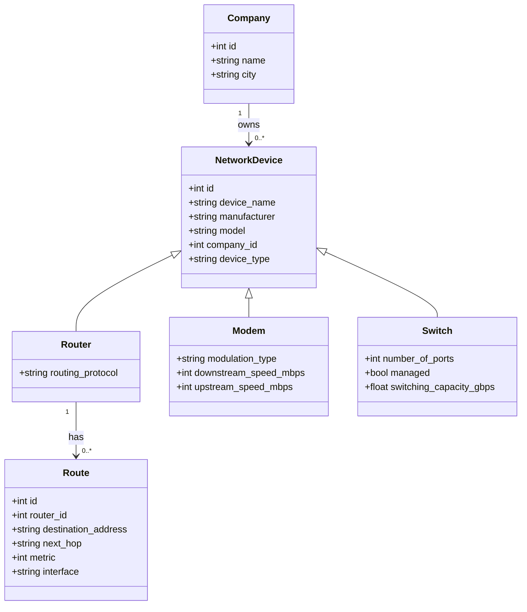
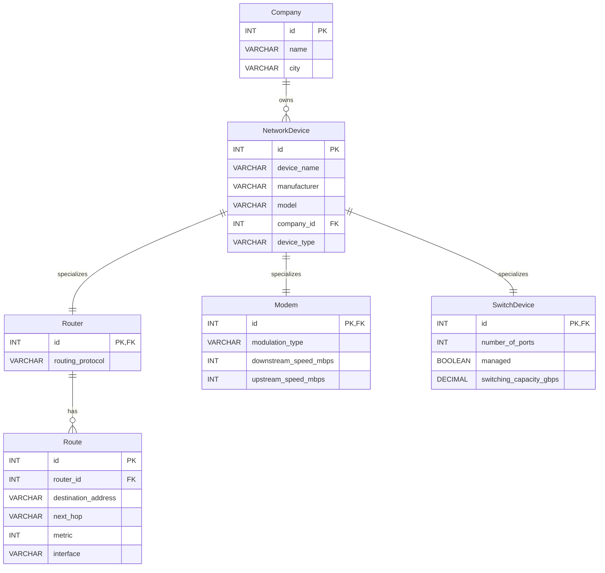
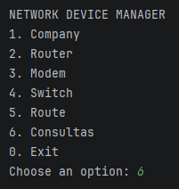
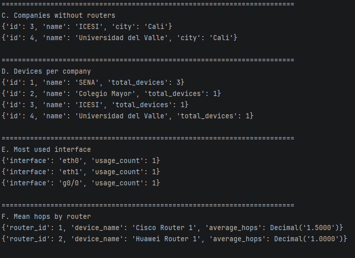
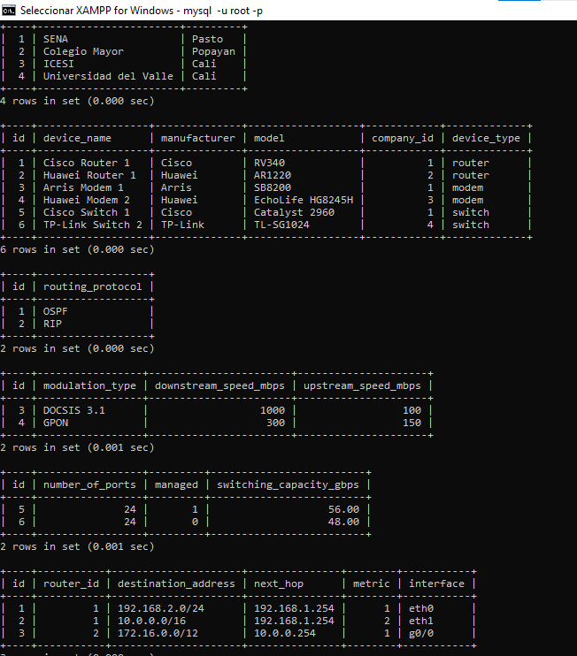

# Network Devices Management System

A console-based Python application for managing network infrastructure data using **MySQL/MariaDB**.  
The system supports CRUD operations for **Company**, **Router**, **Modem**, **Switch**, and **Route**, and includes analytical SQL queries to inspect the network environment.

## Overview

This project models a small network inventory and routing management system with an object-oriented design in Python and a relational database in MySQL/MariaDB.

### Main capabilities

- Manage companies that own network devices
- Manage specialized network devices:
  - Routers
  - Modems
  - Switches
- Manage routing entries associated with routers
- Run analytical queries directly from the Python application
- Work with a normalized relational database using foreign keys

## Tech stack

- **Language:** Python 3
- **Database:** MySQL / MariaDB
- **Environment:** XAMPP
- **Connector:** `mysql-connector-python`

## Relationships

- One **Company** can own many **NetworkDevice** records
- One **NetworkDevice** can specialize into:
  - one **Router**
  - one **Modem**
  - one **SwitchDevice**
- One **Router** can have many **Route** records

## UML class diagram

## Database diagram

## Screenshots
assets/screenshots/menu.png
### Menu

## Queries

## Tablas y dispositivos 

### Menu and Companies

## Authors

- `Aurelio Muñoz`
- `Victor Chavarro`
