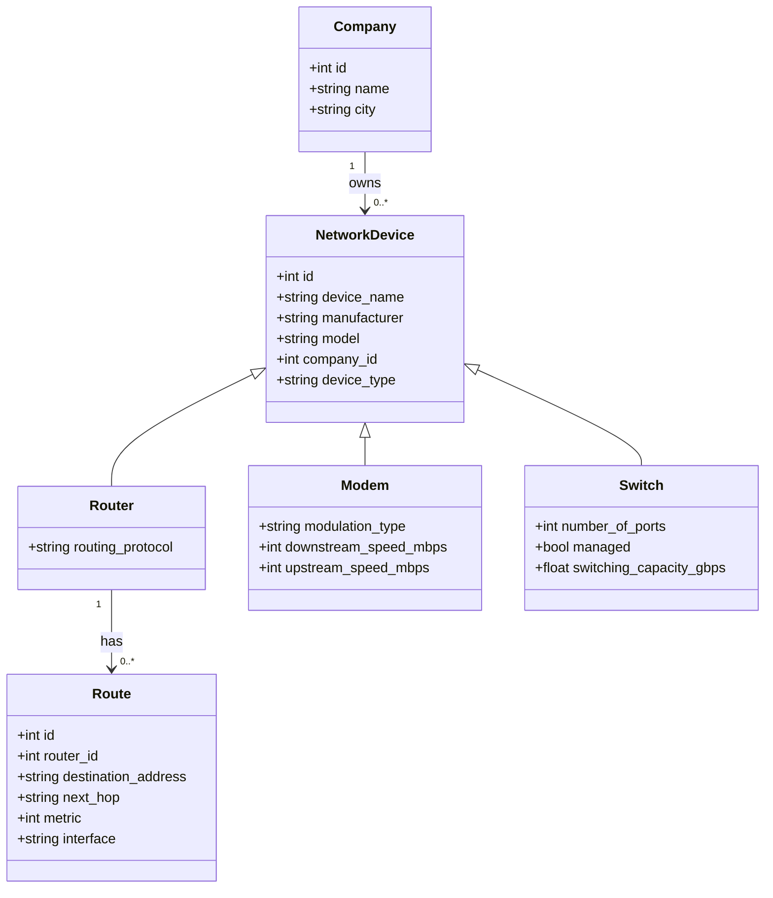
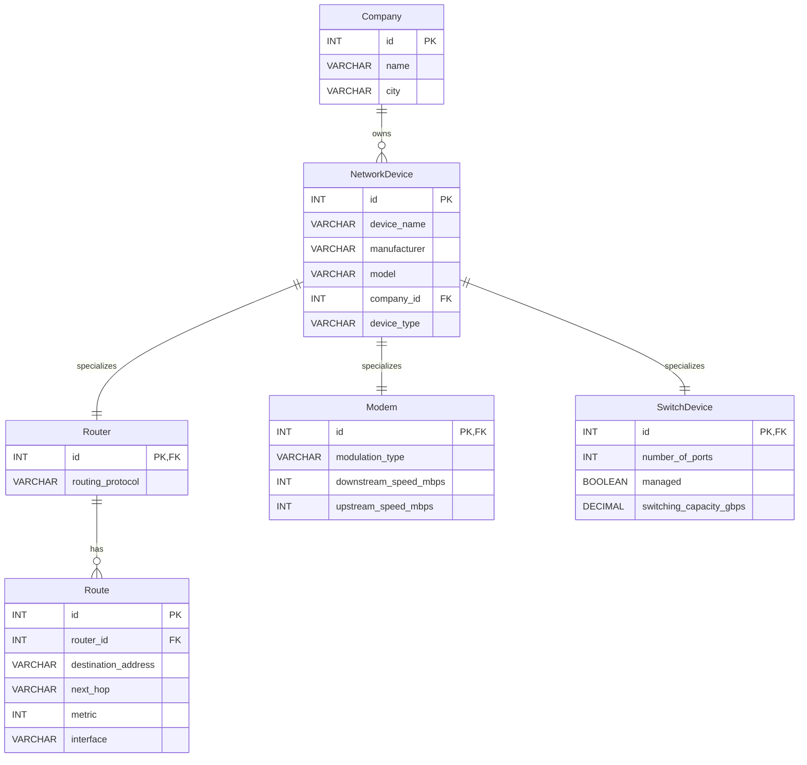

# Network Devices Management System

A console-based Python application for managing network infrastructure data using **MySQL/MariaDB**.  
The system supports CRUD operations for **Company**, **Router**, **Modem**, **Switch**, and **Route**, and includes analytical SQL queries to inspect the network environment.

## Overview

This project models a small network inventory and routing management system with an object-oriented design in Python and a relational database in MySQL/MariaDB.

### Main capabilities

- Manage companies that own network devices
- Manage specialized network devices:
  - Routers
  - Modems
  - Switches
- Manage routing entries associated with routers
- Run analytical queries directly from the Python application
- Work with a normalized relational database using foreign keys

## Tech stack

- **Language:** Python 3
- **Database:** MySQL / MariaDB
- **Environment:** XAMPP
- **Connector:** `mysql-connector-python`


## Relationships

- One **Company** can own many **NetworkDevice** records
- One **NetworkDevice** can specialize into:
  - one **Router**
  - one **Modem**
  - one **SwitchDevice**
- One **Router** can have many **Route** records

## UML class diagram



## Database diagram



## Screenshots

> Recommended folder in your GitHub repository: `docs/images/`

### Application screenshot


### Database structure screenshot


### UML / database diagram screenshot


## Example SQL relationships

The system uses foreign keys to preserve integrity across the tables:

- `NetworkDevice.company_id -> Company.id`
- `Router.id -> NetworkDevice.id`
- `Modem.id -> NetworkDevice.id`
- `SwitchDevice.id -> NetworkDevice.id`
- `Route.router_id -> Router.id`

## How to run the project

### 1. Start MySQL from XAMPP
Open XAMPP and start the MySQL service.

### 2. Create the database manually
Use the MySQL console from XAMPP and run your SQL script to create:

- `Company`
- `NetworkDevice`
- `Router`
- `Modem`
- `SwitchDevice`
- `Route`

### 3. Install dependency

```bash
pip install mysql-connector-python
```

### 4. Run the application

```bash
python Main.py
```

## Main menu modules

The console application is organized into these sections:

- Company
- Router
- Modem
- Switch
- Route
- Queries

## Sample analytical queries supported

- Devices with their company
- Route details by router
- Companies without routers
- Device count by company
- Most used interface
- Average route metric by router
- Device count by company and device type
- Maximum route metric per router

## Notes

- The database creation is performed manually in MySQL/MariaDB through XAMPP
- The Python application focuses on connection handling, CRUD operations, and queries
- The design follows an object-oriented model plus a DAO-based persistence layer

## Author

Add your name here.
